# KPN-Single-Image

A PyTorch implementation of kernel prediction network for single image denoising.

## 1 Samples

GT | Input | Denoised by KPN-Single-Image


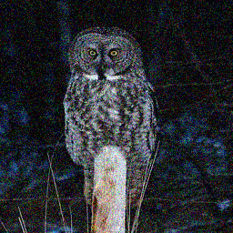
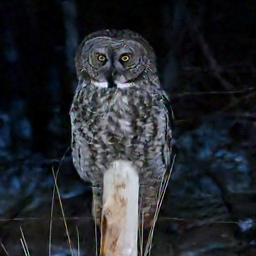

GT | Input | Denoised by KPN-Single-Image


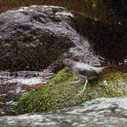
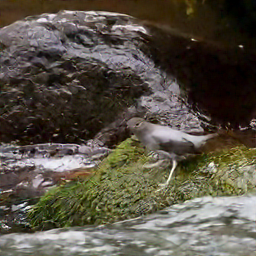

GT | Input | Denoised by KPN-Single-Image


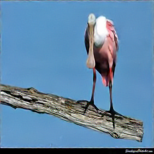

GT | Input | Denoised by KPN-Single-Image


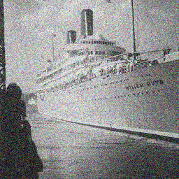
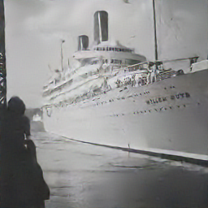

GT | Input | Denoised by KPN-Single-Image


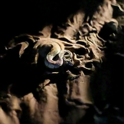

GT | Input | Denoised by KPN-Single-Image

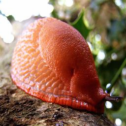


GT | Input | Denoised by KPN-Single-Image


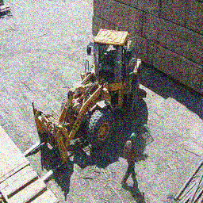


GT | Input | Denoised by KPN-Single-Image

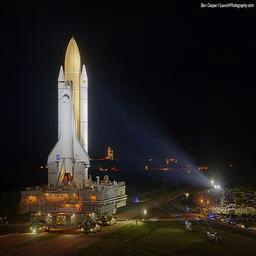
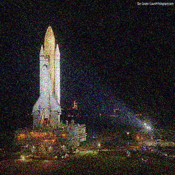
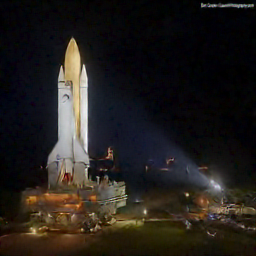

GT | Input | Denoised by KPN-Single-Image


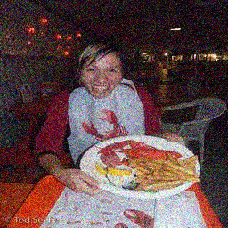
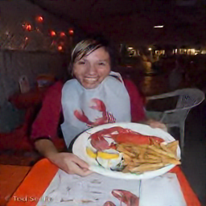

GT | Input | Denoised by KPN-Single-Image

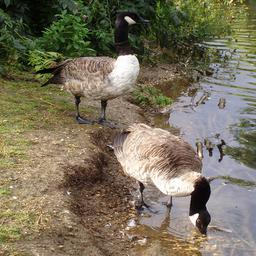

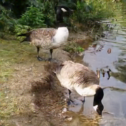

GT | Input | Denoised by KPN-Single-Image

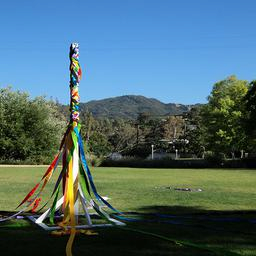
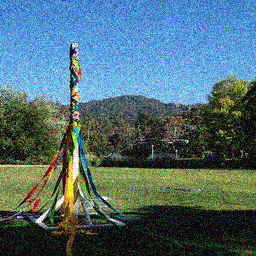


GT | Input | Denoised by KPN-Single-Image

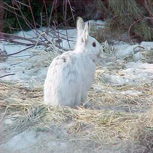
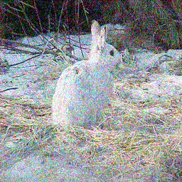
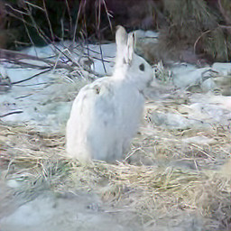

GT | Input | Denoised by KPN-Single-Image


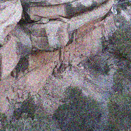


GT | Input | Denoised by KPN-Single-Image


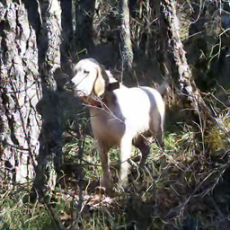

## 2 Training

Trained models are available via this [OneDrive link](https://portland-my.sharepoint.com/:f:/g/personal/yzzhao2-c_my_cityu_edu_hk/EuR2U0LqQyxDtgK06ObvK8gBsvKk3ez0miHSjWMIfkqcpQ?e=hR6sXc)

If you want to train your own data, change arg `baseroot` to your own data path, then run:
```bash
sh run.sh
```

## 3 Validation

We only provide one kind of model for specific noise level. If you want to test your own data, change the arg `baseroot` to the path to your validation set, `save_name` to saving path, and `load_name` to trained model path.
```bash
python validation.py
```

## 4 Acknowledgement

This KPN code is borrowed from the [project](https://github.com/z-bingo/kernel-prediction-networks-PyTorch).

```bash
@inproceedings{mildenhall2018burst,
  title={Burst denoising with kernel prediction networks},
  author={Mildenhall, Ben and Barron, Jonathan T and Chen, Jiawen and Sharlet, Dillon and Ng, Ren and Carroll, Robert},
  booktitle={Proceedings of the IEEE Conference on Computer Vision and Pattern Recognition},
  pages={2502--2510},
  year={2018}
}
```
